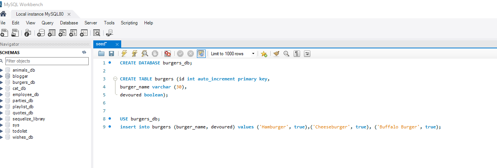
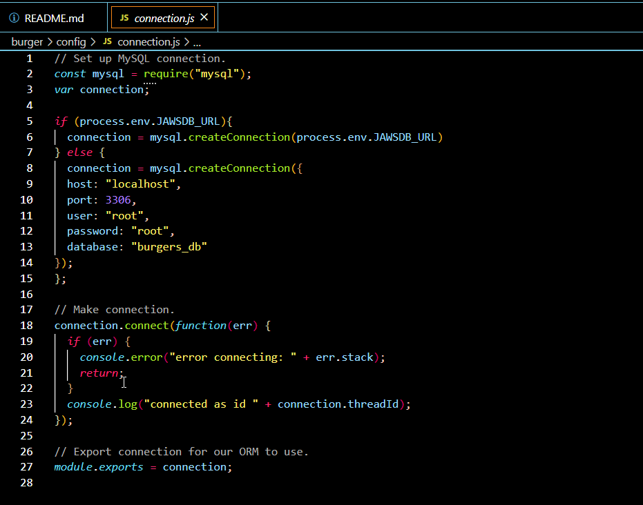
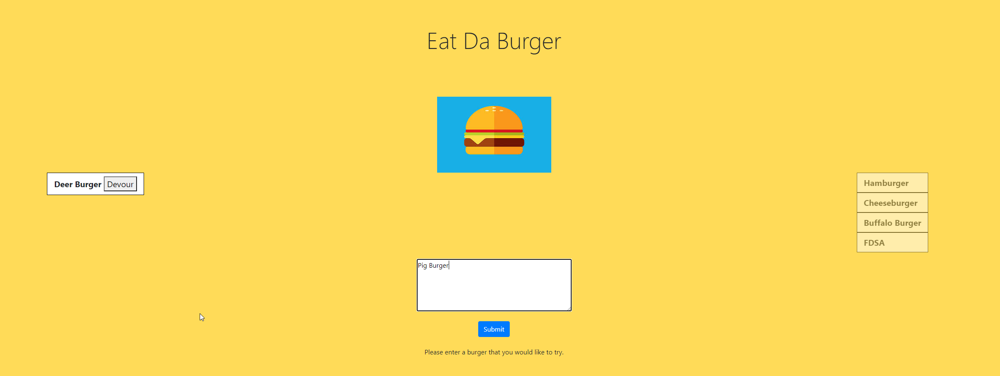

# Burger App

 ## Description 
  This is a sample and fun Burger App that keeps track of what burgers you want to try along with the burgers you have eaten.  This application is deployed and modeled after the MVC file layout (Models, Views, Controllers).

  ## Table of Contents
  [1.  Installation](##Installation) 

  [2.  Instructions](##Instructions)

  [3.  Schema File](##SchemaFile)

  [4.  Connect File](##ConnectFile)

  [5.  App](##App)
  
  [6.  Questions](##Questions)

## Installation
  This needs requires the use of the following packages:

  [MySQL](https://www.npmjs.com/package/mysql)

  [Express](https://www.npmjs.com/package/express)

  [Express-Handlebars](https://www.npmjs.com/package/express-handlebars)

## Instructions

  1.    Make sure node.js is installed.
  2.    Run npm init
  3.    Run npn install mySql Express Express-Handlebars
  4.    Run the Schema File and Seed File to initialize the Application (Schema File section below)
  5.    Change the configuration.js file to connect to the correct database and also edit the file   with the database username and password.  (Connection file section below).
  6.    Run the Application.

## SchemaFile

  Below is a picture of the Schema and Seed file.
  
  

## ConnectFile

  Below is a snippet of the modified Connection.JS

  

## App 

  

## Questions

  [Github Repository](https://github.com/kurt-austin/burger)

  [Heroku Repository](https://git.heroku.com/quiet-temple-02459.git)

  [Eat Da Burger Deployed App](https://quiet-temple-02459.herokuapp.com/)

  [Contact](kurt.austin@gmail.com)
